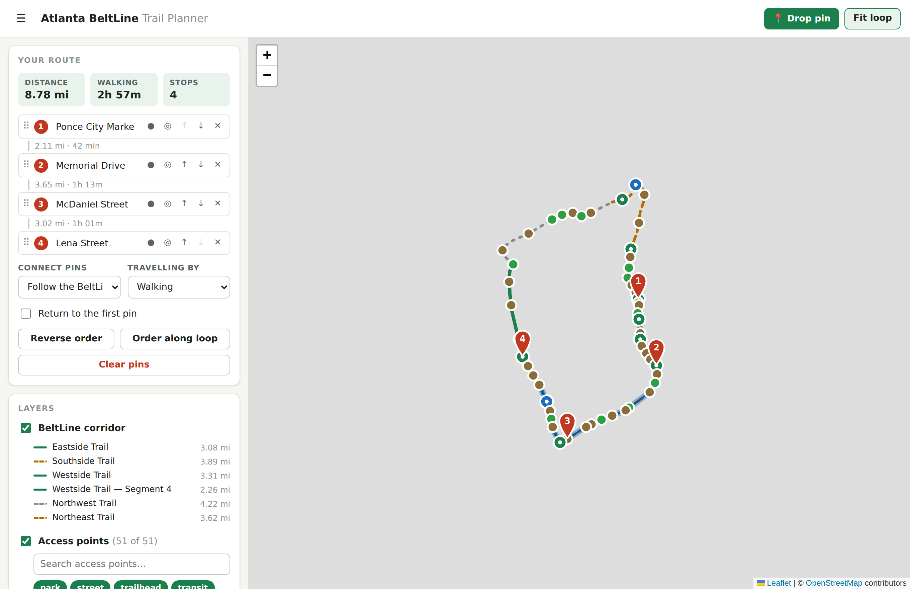

# Atlanta BeltLine Trail Planner

A map of Atlanta with the full BeltLine loop traced on it. Show or hide the access
points, drop pins anywhere, drag them into the order you want to visit them, and the
app links them into a route that follows the trail. Download the result as GeoJSON,
GPX, KML or CSV.

No build step and no server required — open `index.html` and it runs.



*Captured without basemap tiles, so the corridor and the route read clearly. In a
browser with a network connection the loop sits on top of the usual map.*

## Running it

```sh
git clone https://github.com/liambarnum/atlantamap.git
cd atlantamap
open index.html          # macOS; or xdg-open / just double-click it
```

Opening the file directly works. If you would rather serve it:

```sh
python3 -m http.server 8000   # then visit http://localhost:8000
```

### Live on GitHub Pages

`.github/workflows/pages.yml` publishes the site on every push to `main` or the feature
branch. It needs enabling once: **Settings → Pages → Source → GitHub Actions**. After
that the site is at `https://liambarnum.github.io/atlantamap/` and updates itself on
each push.

The workflow runs the tests first and refuses to deploy if they fail. It also
regenerates `data/` and fails if the result differs from what is committed, so the
bundled data can never drift from `tools/build-data.js`.

## What it does

**Find a place.** Search for an address, a landmark, a business or a ZIP code and add it
to your route. Typing matches the bundled access points and BeltLine segments instantly
with no network call; pressing enter also geocodes the text. Every result has a **+**
that drops it into the route order, and found places show on the map as purple search
markers until you add or clear them.

Results are restricted to Atlanta, by ZIP code rather than by bounding box. A box drawn
around Atlanta also contains Decatur, Marietta, Smyrna, Tucker and College Park, so the
postcode is what actually decides: a known Atlanta ZIP is kept, a known non-Atlanta ZIP
is dropped, and a result with no postcode at all — parks, intersections, neighbourhoods
often have none — falls back to the box. Results in the ZIPs the BeltLine itself runs
through are listed first. The list is the USPS definition, so Sandy Springs and Vinings
addresses resolve, because those carry Atlanta mailing addresses and someone typing one
expects it to work.

**The corridor.** All six named segments of the 22-mile loop, coloured by status —
green for open, orange for building, grey for planned — with the same colour on the
line, the legend swatch, the status badge and the filter chip, so the legend is a key
rather than decoration. Nothing is dashed and every segment is the same weight, so
colour is the only thing carrying meaning. Each segment can be hidden on its own,
filtered out by status, or the whole corridor switched off. Clicking a segment shows
its status, what that status means, and its length.

The statuses are **Open** (green), **Interim** (blue — walkable but not the finished
surface), **Building** (orange), **Planned** (grey) and **Closed** (red).
`tools/build-data.js` rejects any other value, so a typo cannot quietly become a sixth
category. As currently mapped: Eastside, Westside and Westside Segment 4 are open;
Southside and Northeast are building; Northwest is planned.

**Access points.** 51 trailheads, park entrances, transit connections and street
crossings. Toggle the whole layer, filter by type with the chips, or filter by name,
amenity or segment — the map and the list narrow together. Each has a popup with its
amenities and an **Add to route** button. (The filter box in Layers controls which
markers are drawn; *Find a place* at the top searches for things to add.)

**Pins.** Press **Drop pin** and click anywhere to place one; the mode stays on so you
can place several, and <kbd>Esc</kbd> ends it. Clicking directly on the trail pins that
exact spot on the corridor, and clicking an access point while in drop mode adds it
straight to the route. Pins can be dragged to new positions on the map, renamed in the
sidebar or in their popup, given notes, and deleted.

**Order and linking.** The sidebar list *is* the order. Drag rows to rearrange them,
use the arrow buttons, or hold <kbd>Alt</kbd> and press <kbd>↑</kbd>/<kbd>↓</kbd>.
Distance and time appear between each pair of stops and as a total across the top.
Other controls:

- **Connect pins** — *Follow the BeltLine* routes each leg along the corridor, taking
  the shorter way round the loop. *Straight lines* draws direct lines instead. A pin
  further than 400 m from the corridor falls back to a straight line for that leg, and
  the leg is marked so you can see it happened.
- **Return to the first pin** closes the route into a loop.
- **Order along loop** re-sorts the stops into the order you would actually reach them.
- **Travelling by** switches the time estimate between walking, running and biking.
- A pin can be kept on the map but left out of the route with the ● button.

**Download and share.** GeoJSON, GPX, KML and CSV, optionally with the corridor and
every access point folded in. Import reads GeoJSON, GPX and KML back. *Copy share link*
puts the whole route in the URL, so it survives being pasted to someone else with no
account or server involved. *Open in Google Maps* hands the stops to Google Maps
directions.

Pins, route and settings are kept in `localStorage`. The only thing that ever leaves
the page is the text you type into **Find a place**, and only when you press enter: it
goes to [Nominatim](https://nominatim.openstreetmap.org/), or to Google's geocoder when
the Google basemap is running. Typing alone stays local.

## Basemaps

The map runs on OpenStreetMap out of the box, with Leaflet vendored into
`vendor/leaflet/` so there is no CDN to depend on.

To use Google Maps instead, pick **Google Maps** under Basemap and paste a Maps
JavaScript API key. The key is kept in `localStorage` in your browser and is only ever
sent to Google. You will need:

1. A Google Cloud project with billing enabled.
2. The **Maps JavaScript API** switched on for it.
3. If you restrict the key by HTTP referrer, an entry that allows wherever you are
   serving this page from.

If Google rejects the key, the app says so and offers to drop back to OpenStreetMap
rather than showing you a blank grey rectangle.

Both basemaps go through the adapter in `js/map.js`, so nothing in the application
logic knows or cares which one is running.

Place search follows the same pattern in `js/geocode.js`. With the Google basemap it
tries Google's geocoder first, reusing the already-loaded SDK — that needs the
**Geocoding API** enabled too, which is a separate switch from the Maps JavaScript API,
so it falls through to Nominatim rather than failing when it isn't. On OpenStreetMap it
goes straight to Nominatim, which needs no key.

## About the bundled data

**The corridor and access point positions in this repository are hand-traced
approximations.** They are accurate to roughly a block, which is fine for planning a
walk and not fine for anything that needs real precision. The traced loop measures
20.4 miles against the real 22, because a hand trace cuts corners the rail bed does
not.

The Eastside Trail has had a correction pass, re-anchored on landmarks: the trail runs
along the *east* side of Ponce City Market and forms the east edge of Historic Fourth
Ward Park, and Krog Street Market sits at Irwin Street rather than a few hundred metres
north of it. The earlier trace had that stretch roughly 150 m too far west. The other
five segments have not had the same pass and are the weaker part of the dataset.

`tests/geo.test.js` enforces that every access point sits within 60 m of the corridor,
so the line and the markers cannot drift apart unnoticed.

Two ways to replace it with the real alignment:

**Import it at runtime.** Get the official geometry as GeoJSON, GPX or KML, press
**Import a file…**, and say yes when asked whether to replace the corridor. Routing,
lengths and the legend all pick it up immediately. This does not touch the repository.

**Bake it in.** Edit the coordinate tables in `tools/build-data.js` and regenerate:

```sh
node tools/build-data.js
```

That writes all four files in `data/`. It refuses to emit anything if the segments no
longer join end to end or the loop fails to close, which is the failure that would
otherwise show up later as routing quietly taking the long way round.

Two sources worth pulling from, neither of which was reachable from the environment
this was built in:

```sh
# OpenStreetMap, via Overpass
curl -G https://overpass-api.de/api/interpreter --data-urlencode '
  [out:json][timeout:60];
  rel["name"~"Atlanta BeltLine"]["route"="foot"](33.6,-84.6,33.9,-84.2);
  out geom;'
```

The City of Atlanta and Atlanta Regional Commission also publish BeltLine layers
through their ArcGIS open data portals, which export GeoJSON directly.

## Layout

```
index.html              markup and the panel structure
styles.css              all styling, light and dark
js/geo.js               distance, projection onto a path, slicing a loop
js/icons.js             marker artwork as SVG data URIs
js/map.js               the map adapter: one interface, Leaflet and Google behind it
js/geocode.js           place search: Google when available, Nominatim otherwise
js/exporters.js         GeoJSON/GPX/KML/CSV out, GeoJSON/GPX/KML in
js/app.js               state, routing, rendering, event wiring
data/*.geojson          the corridor and access points
data/*.js               the same data as plain scripts, so file:// works
tools/build-data.js     source of truth for both; regenerates data/
tests/geo.test.js       tests for the routing math
tests/geocode.test.js   tests for the Atlanta search restriction
data/sources/           raw exports kept for reference; see its README
vendor/leaflet/         Leaflet 1.9.4 (BSD-2-Clause)
```

Coordinates are `[lat, lng]` everywhere inside the app, and flipped to GeoJSON's
`[lng, lat]` only at the boundaries — in `tools/build-data.js` on the way in and
`js/exporters.js` on the way out.

## Tests

```sh
npm test          # or: node tests/geo.test.js && node tests/geocode.test.js
```

47 checks over the geometry: haversine against known distances, projection onto a
path, and the loop slicing — including that it takes the shorter way round, that
crossing the seam in the coordinate list does not produce a line across the city, and
that the drawn line is always as long as the distance reported for it. The last group
runs against the real corridor data rather than a synthetic path.

`tests/geocode.test.js` adds 30 checks over the Atlanta restriction: ZIP extraction,
which suburbs are kept and which are dropped, the no-postcode fallback, and the
BeltLine-first ranking.

The UI was developed against a Playwright script of 150 checks covering the layers,
segment statuses and status filtering, place search (with the geocoder stubbed, including
its empty and unreachable paths and that out-of-town results are filtered out), pin
dropping, every reordering path, routing modes,
all four export formats, import round trips, share links and persistence.

## Credits

Map data © [OpenStreetMap](https://www.openstreetmap.org/copyright) contributors
(ODbL). [Leaflet](https://leafletjs.com/) is BSD-2-Clause, vendored under
`vendor/leaflet/`. The BeltLine geometry here is an independent approximation and is
not affiliated with or endorsed by Atlanta BeltLine, Inc.
